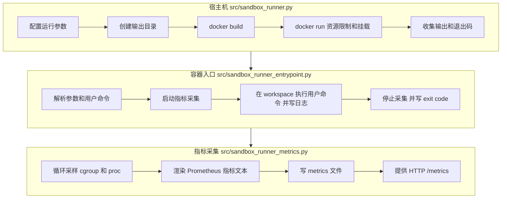

# `sandbox_runner` 关键流程（容器隔离 + 指标采集）

对应代码：
- `src/sandbox_runner.py`：宿主机侧构建/运行容器，并准备挂载目录
- `src/sandbox_runner_entrypoint.py`：容器内入口（启动指标采集 + 执行用户命令并落日志）
- `src/sandbox_runner_metrics.py`：cgroup 采样并以 Prometheus `exposition` 格式输出（同时提供 `/metrics` HTTP）

