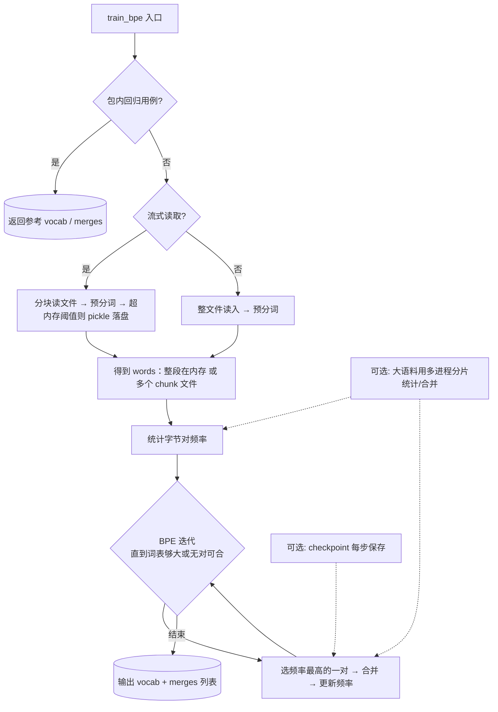

# `train_bpe` 核心流程

对应实现：`src/bpe_tokenizer/train_bpe.py` 中 `train_bpe` 的主干逻辑（略去细节分支）。

```mermaid
flowchart TD
    A[train_bpe 入口] --> B{包内回归用例?}
    B -->|是| Z[(返回参考 vocab / merges)]
    B -->|否| C{流式读取?}

    C -->|是| D[分块读文件 → 预分词 → 超内存阈值则 pickle 落盘]
    C -->|否| E[整文件读入 → 预分词]

    D --> F[得到 words：整段在内存 或 多个 chunk 文件]
    E --> F

    F --> G[统计字节对频率]
    G --> H{BPE 迭代<br/>直到词表够大或无对可合}
    H --> I[选频率最高的一对 → 合并 → 更新频率]
    I --> H
    H -->|结束| J[(输出 vocab + merges 列表)]

    K[可选: checkpoint 每步保存] -.-> I
    L[可选: 大语料用多进程分片统计/合并] -.-> G
    L -.-> I
```
